# COUNTING STARS
## 한 줄 소개

### **`위 변조가 불가능한 NFT 보증서를 발급하여 판매된 명품이 정품이라는 것을 보장할 수 있도록 하는 B2B 디지털 명품 인증 솔루션`**

<br/>

## 기획 배경
1. 매년 커져가는 명품시장의 규모
   
2. 명품 시장의 규모가 커질 수록 가품 문제 증대

3. 온라인 명품 판매점의 신뢰성 부재

4. 중고 명품 거래의 비활성화

<br/>

## 기획 의도
1. Counting Stars의 기획 배경은 파트너사들과의 협력이 명품시장의 발전으로 이어져 나갈 수 있다는 비전에서 탄생했습니다. 

2. Counting Stars는 명품 브랜드들의 탄생 이례로 끊임없이 싸워왔던 진품 보증 문제를 해결함으로써 새로운 기술 허브로 발돋움 하기 위한 서비스입니다.
   
3. Counting Stars는 명품을 구매하는 고객의 구매 경험을 개선하기 위해 신뢰할 수 있고 지속 가능한 새로운 가치를 만들어 낼 수 있는 서비스를 제공합니다.
   
4. Counting Stars는 블록체인의 잠재력을 통해 그동안 힘들다고만 생각해왔던 가품구매의 위험에서 소비자들을 보호하며 새로운 시대를 맞이할 것입니다.

<br/>

## 서비스 특징
1. 모든 명품 파트너사 혹은 명품 구매자들은 규모에 상관없이 누구나 손쉽게 블록체인을 통한 명품 보증 서비스를 사용할 수 있습니다. 

2. Counting Stars는 위 변조가 불가능한 대체 불가능한 토큰(NFT)과 IPFS 기술을 활용하여 모든 고객에게 투명성을 제공하고 신뢰성을 확보합니다.

3. Counting Stars는 명품 구매자들을 위한 디지털 보증 서비스부터 중고시장 판매 시 진품 증명 및 소유권 이전 서비스를 제공합니다.
     
4. 발급된 디지털 인증서를 자신의 지갑를 통해 확인할 수 있으며 모든 기록을 한 눈에 확인할 수 있습니다

<br/><br/>

# 프로젝트 팀원
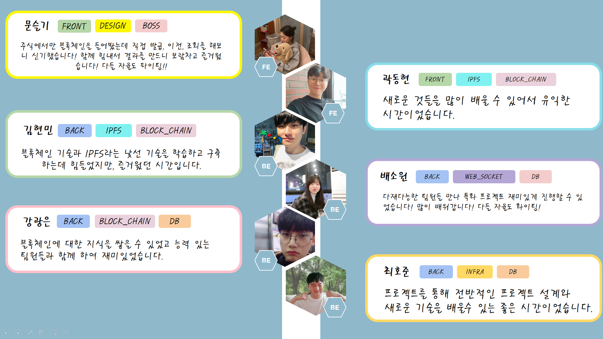

## 프로젝트 진행기간
- 2022.02.28 ~ 2022.04.08 (6주)

<br/>

## 주요 협업 툴
- Jira
- MatterMost
- GitLap
- [Notion](https://changeable-terrier-de5.notion.site/Counting-Stars-55f7ceb8beff49e289f94fd65f1c0670)

<br/><br/>

# 기술 스택
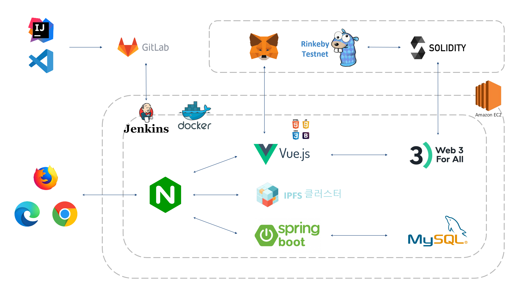
1. AWS EC2에 docker-compose.yml 파일로 Frontend, Backend, IPFS가 빌드된다.
2. Jenkins가 
3. Vue.js와 Metameta가 연동하여
4. Nginx.conf 파일을 통해 Spring 8443 port, Vue 443 port, IPFS


<br/><br/>

# 메인페이지

## 메인 UI
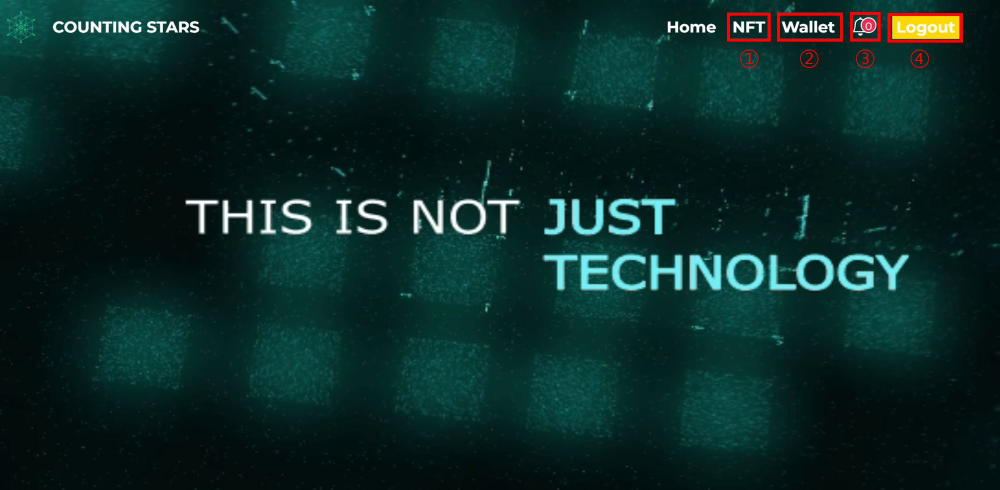
1. 네브바의 NFT 버튼을 누르면 NFT 서비스 화면으로 넘어갈 수 있다. 만약 로그인이 되어 있지 않다면 로그인이 필요하다는 메세지가 화면 아래 출력된다.

2. 네브바의 wallet을 누르면 메타마스크의 계정과 연동할 수 있다.
   
3. NFT가 이전되어 계정으로 들어오면 종모양에 알림이 표시가 된다.
   
4. 로그인 / 로그아웃 버튼을 눌러 로그인 및 회원 가입, 그리고 로그아 웃이 가능하다.

<br/>

## 메타마스크 연동
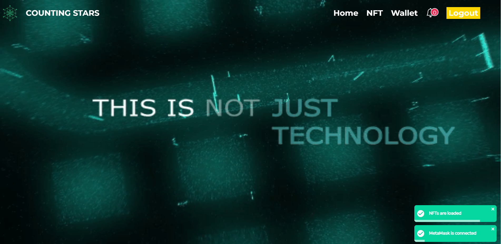
1. 네브바의 wallet 버튼을 누르면 기존 계정과 연동이 된다.
   
2. 오른쪽 하단에 연동 되었다는 알람창과 NFT 목록을 불러오는 알람창이 뜬다.

<br/>

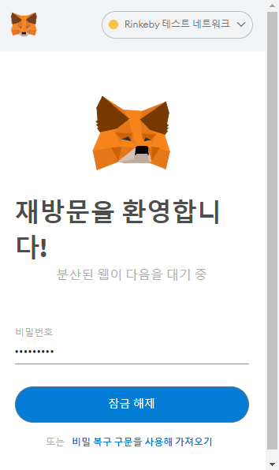
1. 메타마스크가 설치 되어 있는지 확인 할 수 있다.

2. 메타마스크 계정이 연동이 안되어 있다면 연동을 해야 사이트 이용이 가능하다.

<br/>

## 회원가입
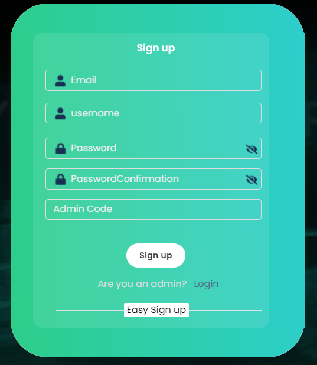
1. 회원가입 폼에 맞게 내용을 입력해준다.
   
2. admin code를 입력하지 않으면 자동으로 일반 유저로 가입이된다.
   
3. 브랜드사, 매장, admin일 경우 입력 후 별도의 키를 입력하면 역할을 따로 부여받는다.

<br/>

## 로그인
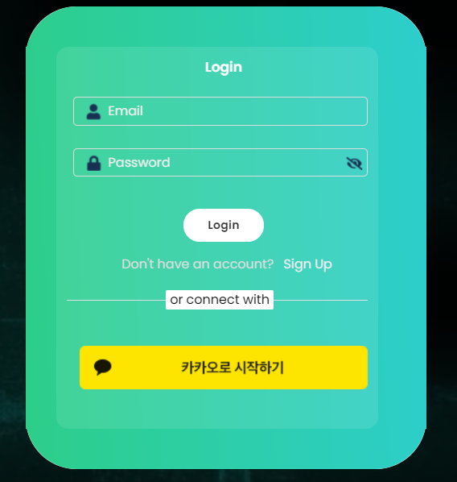
1. 가입한 아이디를 로그인 폼에 맞게 입력하고 로그인을 할 수 있다.
   
2. 카카오톡 간편로그인도 가능하도록 구현 돼 있다.


<br/><br/>

## 사이트 소개
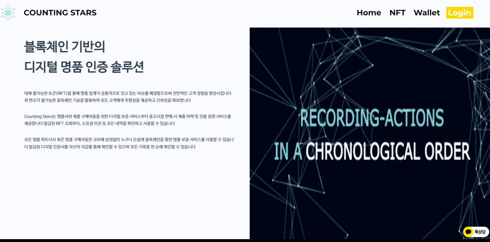
1. 메인페이지에서는 사이트 소개와, 협력사, 블록체인에 대한 설명을 볼 수 있다.

<br/><br/>

# NFT

## MY NFT
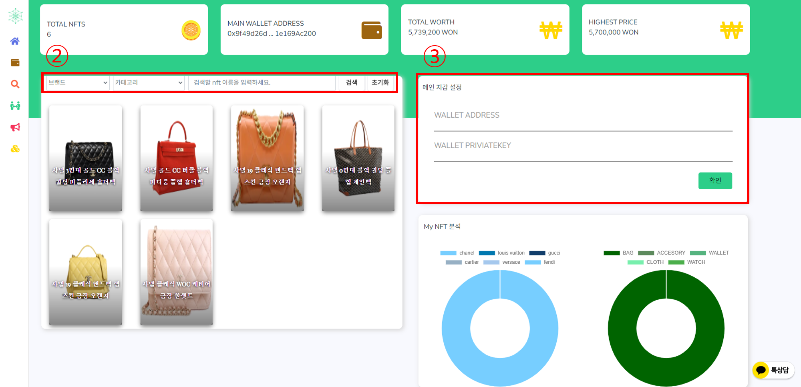
1. 보유한 NFT 목록과 소유한 NFT 정보를 확인할 수 있다.
   
2. 셀렉트 박스를 통해 원하는 NFT를 검색하여 찾을 수 있다.
   
3. 지갑 주소와 Private Key를 입력하여 메인지갑을 설정할 수 있다.
   
4. 메인지갑을 설정하면 보유한 브랜드, 상품에 대한 차트를 볼 수 있다.
   
5. 상단에서 자신의 보유한 NFT 개수, 지갑 주소, 보유 가치, 최고가의 NFT가 얼마인지 확인 가능하다.

<br/>

## NFT 조회
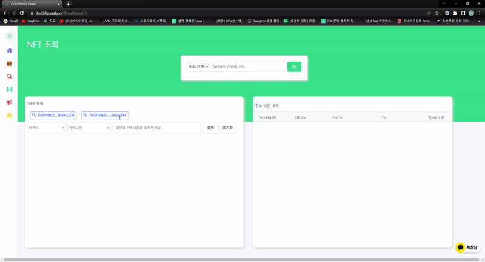
1. 지갑주소와 아이디를 통해 다른 사람의 NFT를 조회할 수 있다.
   
2. 그 지갑의 NFT 이전 내용을 확인할 수 있다.
   
3. 이전에 검색 했던 주소를 다시 쉽게 검색할 수 있도록 최근 검색 목록이 출력된다.
   
4. 트랜잭션 해쉬값을 클릭하면 상세 정보창이 나타난다.
   
5. 셀렉트 박스를 통해 원하는 NFT를 검색하여 찾을 수 있다.

<br/>

## NFT 이전
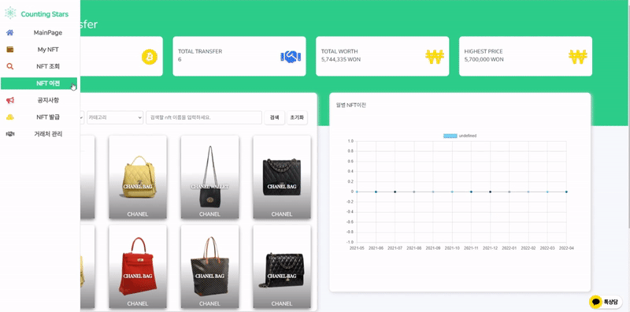

1. 자신이 소유한 NFT 목록과 정보를 확인할 수 있다.
   
2. 월별 이전 내용을 확인할 수 있다.
   
3. NFT 이전 랭킹을 볼 수 있다.
   
4. 소유한  NFT를 선택하여 다른 사람에게 이전을 할 수 있다.
   
5. 셀렉트 박스를 통해 원하는 NFT를 검색하여 찾을 수 있다.

<br/>

## NFT 이전 알람


1. NFT를 이전 받게 되면 메인화면 종모양에 알림이 표시되고, 받은 NFT 목록창을 확인할 수 있다.

<br/>

## NFT 일괄 발급
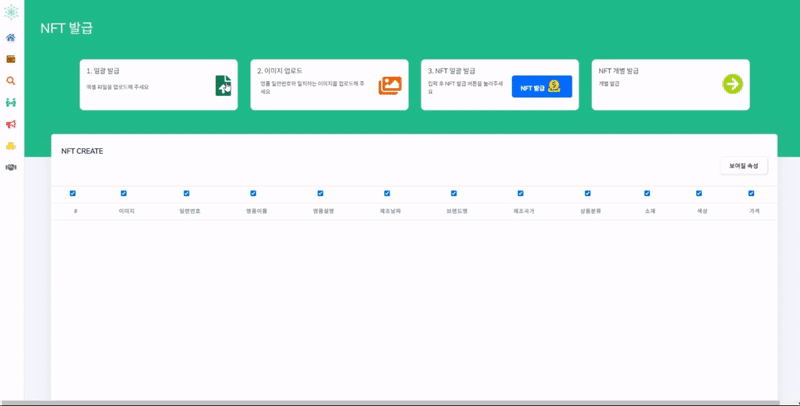
1. 엑셀파일의 명품 정보를 업로드하여 NFT를 한번에 여러개 발급할 수 있다.
   
2. 명품 일련번호와 일치하는 이미지를 업로드 할 수 있다.
   
3. NFT 발급을 누르게 되면 이미지나 정보가 누락된 명품들을 제외하고 모두 발급한다.

4. 혹시나 정보가 잘못 된 것이 있을 경우 페이지에서 바로 수정해서 발급이 가능하다.

5. 수정의 편의를 고려하여 체크 박스를 통해 정보 표시 / 비표시 할 수 있다.

<br/>

## NFT 개별 발급
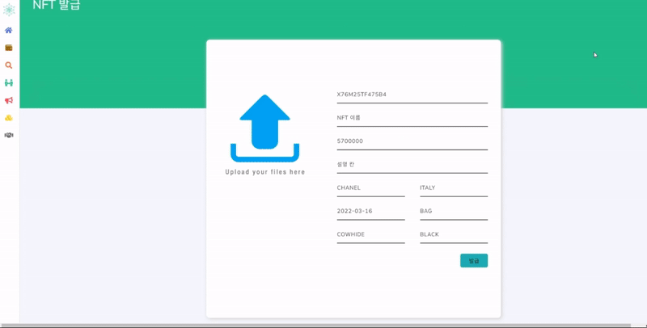
1. 개별 발급을 하고 싶다면 NFT 개별 발급 버튼을 통해 개별 발급 페이지로 이동할 수 있다.
   
2. NFT 정보를 입력 폼에 맞게 입력하여 NFT를 개별 발급 할 수 있다

<br/><br/>

# 관리자 페이지
## 챗봇

1. 고객사나 일반 유저들은 챗봇을 이용 할 수 있다.
   
2. 질문을 남기면 admin 계정으로 챗봇 메세지가 간다.
  
3. 사이트 관리자는 유저에게 카카오 메세지로 답변을 줄 수 있다.

<br/>

## 공지사항
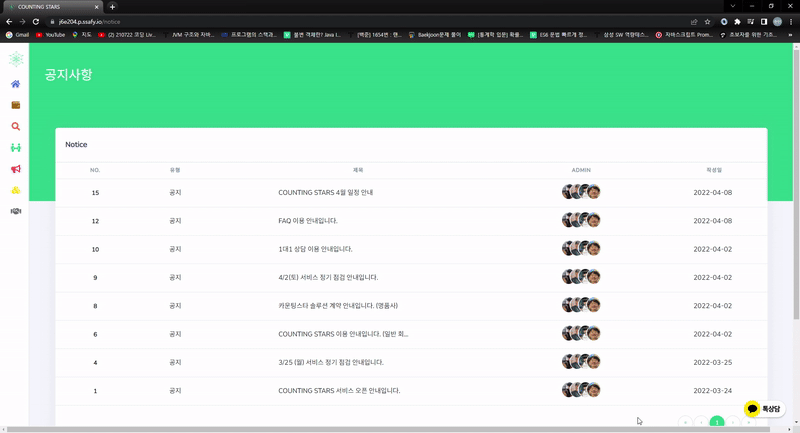
1. 일반 유저들은 공지사항을 확인할 수 있다.
   
2. admin 계정은 공지사항을 등록, 수정, 삭제가 가능하다.

<br/><br/>

## 거래처관리 페이지
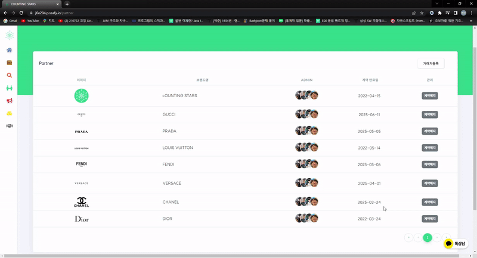
1. admin 계정은 거래처를 등록하고 삭제할 수 있다.
   
2. 등록된 거래처 목록은 NFT를 조회할 때 브랜드에 자동으로 담긴다.

<br/><br/>

# 빌드 및 배포에 필요한 정보

## 1. 주요 버전
```cmd
1. JVM : 1.8.0_192
2. Web Server : Nginx 1.18.0
3. WAS : Tomcat 9.0.45
4. Visual Studio : 1.64.2
5. IntelliJ : IntelliJ IDEA 2021.3.2 (community)
6. Vue : 3.0.0
7. NodeJS : v16.13.1
8. springBootVer : '2.6.4'
9. solidity : 0.8.12
10. web3js : 1.7.1
11. ipfs-http-client : 56.0.2
12. 기타 상세 버전 정보
    - Vue : pakage.json
    - SpringBoot : build.gradle
```

<br/>

## 2. Dockerfile / Frontend

```docker
FROM node:14 as build-stage
WORKDIR /app
COPY package*.json ./
RUN npm install
COPY . .
RUN npm run build

FROM nginx:stable-alpine as production-stage
COPY  ./nginx/nginx.conf /etc/nginx/conf.d/default.conf

COPY --from=build-stage /app/dist /usr/share/nginx/html

CMD ["nginx", "-g", "daemon off;"]
```

<br/>

## 3. nginx.conf / Frontend
```docker
# frontend/nginx/nginx.conf

server {
    listen 80;
    listen [::]:80;
	
    # server_name 도메인; 
    server_name <aws_ec2_domain_name>;

		access_log /var/log/nginx/access.log;
		error_log /var/log/nginx/error.log;

    location / {
        return 301 https://$server_name$request_uri; # http 접속 시 https 로 자동 접속
    }
}

server {
	listen 443 ssl;
	listen [::]:443 ssl;
	
	# server_name 도메인;
	server_name <aws_ec2_domain_name>;

	access_log /var/log/nginx/access.log;
	error_log /var/log/nginx/error.log;

	ssl_certificate /var/www/html/fullchain.pem;
	ssl_certificate_key /var/www/html/privkey.pem;

	root /usr/share/nginx/html;
	index index.html;

	# ~ /api/v0/add
	location /api/v0/ {
        proxy_pass <docker_http_ip4_address>;
        proxy_set_header Host $host;
        proxy_cache_bypass $http_upgrade;
    }

	location / {
		try_files $uri $uri/ /index.html;
	}

	location /api {
		proxy_pass <aws_ec2_domain_name:backend_port/api>;
	}
}
```

<br/>

## 4. Dockerfile / Backend
```docker
# backend/Dockerfile
# 사용한 openjdk 버전에 맞는 값을 입력해주세요.
FROM openjdk:8-jdk-alpine

# jar 파일 경로는 직접 입력해주세요.
COPY build/libs/cstars-0.0.1-SNAPSHOT.jar app.jar
EXPOSE 8443
# 배포용 properties 실행 명령어
ENTRYPOINT ["java","-jar","app.jar","--spring.config.name=application-prod"] 

# 만약 배포용 properties를 사용하지 않는다면
# Default properties 실행 명령어
# ENTRYPOINT ["java","-jar","app.jar"]
```

<br/>

## 5. application-prod.properties / Backend
```properties
server.port=8443
server.ssl.enabled=true
server.ssl.key-store-type=PKCS12
server.ssl.key-store=/root/key.p12
server.ssl.key-store-password=<ssl_password>

spring.data.web.pageable.one-indexed-parameters = true
spring.datasource.driver-class-name = com.mysql.cj.jdbc.Driver
spring.datasource.url = jdbc:mysql://<aws_ec2_domain_name:3306>/counting_stars?useUnicode=true&characterEncoding=utf8&serverTimezone=Asia/Seoul&zeroDateTimeBehavior=convertToNull&rewriteBatchedStatements=true&useSSL=false
spring.datasource.hikari.username = <db_username>
spring.datasource.hikari.password = <db_password>

spring.devtools.livereload.enabled = ture

spring.jpa.hibernate.ddl-auto = update
spring.jpa.hibernate.naming.implicit-strategy = org.springframework.boot.orm.jpa.hibernate.SpringImplicitNamingStrategy
spring.jpa.hibernate.naming.physical-strategy = org.springframework.boot.orm.jpa.hibernate.SpringPhysicalNamingStrategy
spring.jpa.properties.hibernate.dialect = org.hibernate.dialect.MySQL57Dialect
spring.jpa.properties.hibernate.show_sql = true
spring.jpa.properties.hibernate.format_sql = ture

# spring.mvc.throw-exception-if-no-handler-found = true
# spring.mvc.pathmatch.matching-strategy = ant_path_matcher # springboot 2.6 version swagger 3.0.0 version error

# springfox.documentation.swagger.use-modle-v3 = false

sms.serviceId = <serviceId>
sms.accessKey = <accessKey>
sms.secretKey = <secretKey>

# App Properties
bezkoder.app.jwtSecret = bezKoderSecretKey
bezkoder.app.jwtExpirationMs = 3600000
bezkoder.app.jwtRefreshExpirationMs = 86400000

# spring.main.allow-bean-definition-overriding = true
##

```

<br/>

## 6. Docker-Compose.yml / Root

```yaml
version: '3.2'

services: 
  frontend:
    image: frontend-vue
    build:
      context: frontend/
      dockerfile: Dockerfile
    ports:
      - "80:80"
      - "443:443" 
    # [인증서 파일 저장 경로]:/var/www/html
    volumes:
      - /home/ubuntu/docker-volume:/var/www/html
    container_name: "frontend"
    # networks:
    #   - counting_star
  
  backend:
    image: backend-spring
    build:
      context: backend/
      dockerfile: Dockerfile
    ports:
      - "8443:8443"
      # [인증서 파일 저장 경로]:/root
    volumes:
      - /home/ubuntu/docker-volume:/root
    container_name: "backend"

  ipfs0:
    container_name: ipfs0
    image: ipfs/go-ipfs:latest
    ports:
      - "4001:4001" # ipfs swarm - expose if needed/wanted
      - "5001:5001" # ipfs api - expose if needed/wanted
      # - "172.17.0.1:8000:8000" # ipfs gateway - expose if needed/wanted
    environment:
      - LIBP2P_FORCE_PNET=1 # 네트워크 보호를 강화
      - IPFS_SWARM_KEY_FILE=/home/ubuntu/docker-volume/compose/ipfs0/swarm.key # IPFS끼리 같은 swarm.key를 공유
    volumes:
      - /home/ubuntu/docker-volume/compose/ipfs0:/data/ipfs

  cluster0:
    container_name: cluster0
    image: ipfs/ipfs-cluster:latest
    depends_on:
      - ipfs0
    environment:
      CLUSTER_IPFSHTTP_NODEMULTIADDRESS: /dns4/ipfs0/tcp/5001
      CLUSTER_RESTAPI_HTTPLISTENMULTIADDRESS: /ip4/0.0.0.0/tcp/9094 # Expose API
      IPFS_BOOTSTRAP_RM_ALL: "true" # 다른 네트워크 목록 전부 지움
    ports:
          - "9092:9094"
    volumes:
      - /home/ubuntu/docker-volume/compose/cluster0:/data/ipfs-cluster

##################################################################################
## Cluster PEER 1 ################################################################
##################################################################################

# See Cluster PEER 0 for comments (all removed here and below)
  ipfs1:
    container_name: ipfs1
    image: ipfs/go-ipfs:latest
    ports:
      - "4002:4001" # ipfs swarm - expose if needed/wanted
      - "5002:5001" # ipfs api - expose if needed/wanted
      # - "172.17.0.1:8001:8000" # ipfs gateway - expose if needed/wanted
    environment:
      - LIBP2P_FORCE_PNET=1
      - IPFS_SWARM_KEY_FILE=/home/ubuntu/docker-volume/compose/ipfs1/swarm.key
    volumes:
      - /home/ubuntu/docker-volume/compose/ipfs1:/data/ipfs

  cluster1:
    container_name: cluster1
    image: ipfs/ipfs-cluster:latest
    depends_on:
      - ipfs1
    environment:
      CLUSTER_IPFSHTTP_NODEMULTIADDRESS: /dns4/ipfs1/tcp/5001
      CLUSTER_RESTAPI_HTTPLISTENMULTIADDRESS: /ip4/0.0.0.0/tcp/9094 # Expose API
      IPFS_BOOTSTRAP_RM_ALL: "true"
    ports:
      - 9093:9094
    volumes:
      - /home/ubuntu/docker-volume/compose/cluster1:/data/ipfs-cluster

##################################################################################
## Cluster PEER 2 ################################################################
##################################################################################

# See Cluster PEER 0 for comments (all removed here and below)
  ipfs2:
    container_name: ipfs2
    image: ipfs/go-ipfs:latest
    ports:
      - "4003:4001" # ipfs swarm - expose if needed/wanted
      - "5003:5001" # ipfs api - expose if needed/wanted
      # - "172.17.0.1:8002:8000" # ipfs gateway - expose if needed/wanted
    environment:
      - LIBP2P_FORCE_PNET=1 # 네트워크 보호를 강화
      - IPFS_SWARM_KEY_FILE=/home/ubuntu/docker-volume/compose/ipfs2/swarm.key
    volumes:
      - /home/ubuntu/docker-volume/compose/ipfs2:/data/ipfs

  cluster2:
    container_name: cluster2
    image: ipfs/ipfs-cluster:latest
    depends_on:
      - ipfs2
    environment:
      CLUSTER_IPFSHTTP_NODEMULTIADDRESS: /dns4/ipfs2/tcp/5001
      CLUSTER_RESTAPI_HTTPLISTENMULTIADDRESS: /ip4/0.0.0.0/tcp/9094 # Expose API
      IPFS_BOOTSTRAP_RM_ALL: "true"
    ports:
      - 9094:9094
    volumes:
      - /home/ubuntu/docker-volume/compose/cluster2:/data/ipfs-cluster
```

<br/><br/>

# ERD
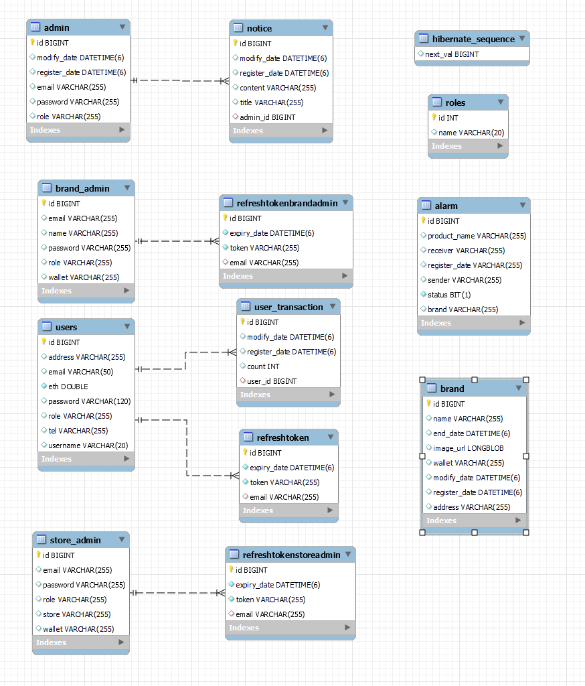

<br/><br/>

# 블록체인 코드

## 1. 스마트 컨트랙트 배포
- 기본적으로 스마트 컨트랙트는 openzeppelin 프레임워크를 사용
- ERC721 토큰에 tokenURI(*ipfs해쉬 값 저장)를 저장하여 데이터를 블록체인에 기록

    ```solidity
    // 대표 기능인 NFT 민팅 함수
    function mintNFT(address to, string memory tokenURI)
            public onlyOwner
            returns (uint256)
        {
            _tokenIds.increment();

            uint256 newItemId = _tokenIds.current();
            _mint(to, newItemId);
            _setTokenURI(newItemId, tokenURI);

            return newItemId;
        }
    ```

<br/>

## 2. VUE, 스마트 컨트랙트 연동(with metamask)
- 메타마스크와 프론트를 연동하여 보유 지갑주소 값을 호출

    ```javascript
    const accounts = await ethereum.request({ method: 'eth_requestAccounts' });
    ```

- web3로 프론트와 스마트 컨트랙트 간 데이터 전달

    ```javascript
    // web3 임포트
    var Web3 = require('web3');

    var web3 = new Web3(new Web3.providers.HttpProvider('https://rinkeby.infura.io/v3/1b71a03449674cfe98b98c4915a7cbc7'));
    // 컨트랙트 abi와 주소를 통해 배포한 컨트랙트를 지정
    let contract = new web3.eth.Contract( contractInfo.abi, contractInfo.address)
    ```

<br/>

## 3. NFT 조회
- openzeppelin ERC721 함수를 사용, 잔고(NFT 수량) 확인

    ```javascript
    const balance = await contract.methods.balanceOf(sendAccount).call();
    ```

- tokenOfOwnerByIndex 함수로 토큰 소유주의 tokenId 확인

    ```javascript
    await contract.methods.tokenOfOwnerByIndex(sendAccount, i).call())
    ```

- tokenURI(tokenID) 함수를 통해 토큰에 저장된 URI의 값을 호출하여 데이터 조회 

    ```web3
    contract.methods.tokenURI(element).call()
    ```

<br/>

## 4. NFT 이전
- NFT 이전시에는 프라이빗 값이 요구됨, privateKeyToAccount로 sender 주소를 지정

    ```javascript
    var sender = web3.eth.accounts.privateKeyToAccount('0x'+receiveKey)
    ```

- web3.eth.accounts.wallet.add(sender)를 통해 signTransaction does not exist 에러 방지

- safeTransferFrom 함수로 소유권이 있는 토큰을 타인에게 이전 가능 ( approved 등의 함수를 통해 소유권 획득 가능)

    ```javascript
    await contract.methods.safeTransferFrom(sendAccount,receiveAccount,parseInt(tokenId)).send({from: sendAccount,gas:600000, })
    ```

<br/>

## 5. NFT 발급

    ```javascript
    const abc = await contract.methods.mintNFT("받는사람 주소","저장할 데이터").send({from: "sender주소",gas:600000, })
    ```

- 기본적으로 이전에 기술한 NFT민팅 함수를 해당 코드를 통해 호출하여 NFT 발급을 완료함. NFT에 정보를 기록하는 방법으로 ipfs해쉬 값을 저장하는 방법을 사용.

- ipfs-http-client 라이브러리를 통해 해쉬값을 읽을 수 있음.

- ipfs private network를 구축하여 분산된 저장을 통해 더욱 보안적인 측면이 강화됨.


<br/><br/>

# IPFS

### 1. 로컬에서 테스트 할 경우 docker-compose.yml 파일의 volumes 위치 수정 후 CMD창에서 ***docker-compose up*** 명령어 입력하면 IPFS가 자동 빌드 된다.

<br/>
  
### 2. 서버에 올라갈 땐 ***Jenkins branch***로 push를 할 경우, ***docker-compose.yml*** 파일을 자동 build하도록 ***shell script***를 작성해 두었다. 

<br/>

### 3. 이때, ***frontend***와 ***backend***도 ***docker-compose.yml*** 파일에 포함되어 같이 build된다.

<br/>
 
### 4. 각 IPFS config 파일 아래와 같이 수정
- cors 에러를 해결하기 위함
    ```shell
    {
        "API": {
        "HTTPHeaders": {
            "API.HTTPHeaders.Access-Control-Allow-Methods": [
            "PUT",
            "POST",
            "GET"
            ],
            "Access-Control-Allow-Origin": [
                "*"
            ]
        }

        ....

        "Gateway": {
        "APICommands": [],
        "HTTPHeaders": {
        "Access-Control-Allow-Headers": [
            "*"
        ],
        "Access-Control-Allow-Methods": [
            "GET",
            "POST",
            "PUT"
        ],
        "Access-Control-Allow-Origin": [
            "*"
        ]
    },
    ```
<br/>

### 5. 각 IPFS 0 ~ 2 폴더 안에 동일한 ***swarm.key***를 가지도록 설정

    ```bash
    // 1. key 생성 오픈소스 다운
    git clone https://github.com/Kubuxu/go-ipfs-swarm-key-gen.git

    // 2. 폴더로 들어감
    cd go-ipfs-swarm-key-gen

    // 3. main.go 파일이 빌드 됨
    go build ipfs-swarm-key-gen/main.go

    // 4. 빌드된 파일 실행 아래 위치로 swarm.key를 만듬
    ./main > /home/ubuntu/docker-volume/compose/swarm.key

    // 5. 키 실행
    cat /home/ubuntu/docker-volume/compose/swarm.key

    // 실행 결과
    /key/swarm/psk/1.0.0/
    /base16/
    1b8eaa4d914fe80ad90c1be32ae964f652ce8cd5bafe5d696d71df8483b173eb

    // 6. ipfs root 폴더로 각각 복사
    ```

<br/>

### 6. ipfs가 AWS EC2에서 정상적으로 작동하고 있다면 ***ipfs-http-client*** API를 통해서 통신

<br/><br/>

# 카카오 챗봇
### 1. 채널 만들기 하면 채널 url 자동으로 생성

<br/>

### 2. 하단의 url 주소로 들어가면 챗봇 이용 가능
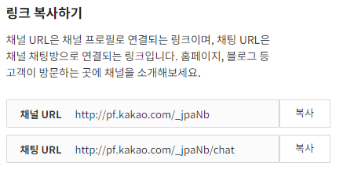

<br/>

### 3. 카카오 채널 기능 구현을 위한 KaKao SDK 설치

```javascript
<!-- 카카오 챗봇 -->
<script src="https://developers.kakao.com/sdk/js/kakao.js"></script>

    <meta charset="utf-8"/>
    <title>Kakao JavaScript SDK</title>
    <script src="https://cdn.jsdelivr.net/npm/ipfs-http-client/dist/index.min.js"></script>
    <script>
    // SDK를 초기화 합니다. 사용할 앱의 JavaScript 키를 설정해 주세요.
    Kakao.init('JAVASCRIPT_KEY');

    // SDK 초기화 여부를 판단합니다.
    // console.log(Kakao.isInitialized());
</script>
```

<br/>

### 4. 사용자가 서비스의 카카오톡 채널과 1:1 채팅을 시작하는 기능을 제공하는 연결 페이지 호출

```javascript
<!-- 챗봇 -->
<script>
    window.kakaoAsyncInit = function() {
    Kakao.Channel.createChatButton({
        container: '#kakao-talk-channel-chat-button',
    });
    };

    (function(d, s, id) {
    var js, fjs = d.getElementsByTagName(s)[0];
    if (d.getElementById(id)) return;
    js = d.createElement(s); js.id = id;
    js.src = 'https://developers.kakao.com/sdk/js/kakao.channel.min.js';
    fjs.parentNode.insertBefore(js, fjs);
    })(document, 'script', 'kakao-js-sdk');
</script>
```
