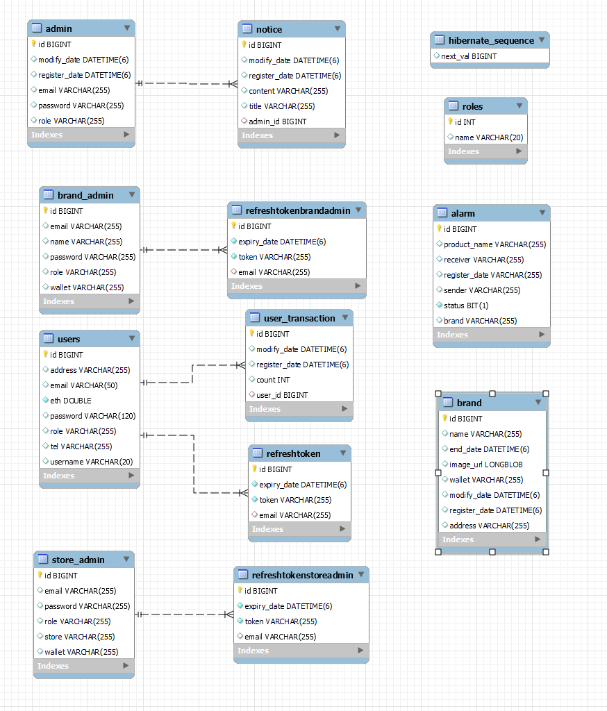

# 빌드 및 배포에 필요한 정보

## 1. 주요 버전
```cmd
1. JVM : 1.8.0_192
2. Web Server : Nginx 1.18.0
3. WAS : Tomcat 9.0.45
4. Visual Studio : 1.64.2
5. IntelliJ : IntelliJ IDEA 2021.3.2 (community)
6. Vue : 3.0.0
7. NodeJS : v16.13.1
8. springBootVer : '2.6.4'
9. solidity : 0.8.12
10. web3js : 1.7.1
11. ipfs-http-client : 56.0.2
12. 기타 상세 버전 정보
    - Vue : pakage.json
    - SpringBoot : build.gradle
```

<br/>

## 2. Dockerfile / Frontend

```docker
FROM node:14 as build-stage
WORKDIR /app
COPY package*.json ./
RUN npm install
COPY . .
RUN npm run build

FROM nginx:stable-alpine as production-stage
COPY  ./nginx/nginx.conf /etc/nginx/conf.d/default.conf

COPY --from=build-stage /app/dist /usr/share/nginx/html

CMD ["nginx", "-g", "daemon off;"]
```

<br/>

## 3. nginx.conf / Frontend
```docker
# frontend/nginx/nginx.conf

server {
    listen 80;
    listen [::]:80;
	
    # server_name 도메인; 
    server_name <aws_ec2_domain_name>;

		access_log /var/log/nginx/access.log;
		error_log /var/log/nginx/error.log;

    location / {
        return 301 https://$server_name$request_uri; # http 접속 시 https 로 자동 접속
    }
}

server {
	listen 443 ssl;
	listen [::]:443 ssl;
	
	# server_name 도메인;
	server_name <aws_ec2_domain_name>;

	access_log /var/log/nginx/access.log;
	error_log /var/log/nginx/error.log;

	ssl_certificate /var/www/html/fullchain.pem;
	ssl_certificate_key /var/www/html/privkey.pem;

	root /usr/share/nginx/html;
	index index.html;

	# ~ /api/v0/add
	location /api/v0/ {
        proxy_pass <docker_http_ip4_address>;
        proxy_set_header Host $host;
        proxy_cache_bypass $http_upgrade;
    }

	location / {
		try_files $uri $uri/ /index.html;
	}

	location /api {
		proxy_pass <aws_ec2_domain_name:backend_port/api>;
	}
}
```

<br/>

## 4. Dockerfile / Backend
```docker
# backend/Dockerfile
# 사용한 openjdk 버전에 맞는 값을 입력해주세요.
FROM openjdk:8-jdk-alpine

# jar 파일 경로는 직접 입력해주세요.
COPY build/libs/cstars-0.0.1-SNAPSHOT.jar app.jar
EXPOSE 8443
# 배포용 properties 실행 명령어
ENTRYPOINT ["java","-jar","app.jar","--spring.config.name=application-prod"] 

# 만약 배포용 properties를 사용하지 않는다면
# Default properties 실행 명령어
# ENTRYPOINT ["java","-jar","app.jar"]
```

<br/>

## 5. application-prod.properties / Backend
```properties
server.port=8443
server.ssl.enabled=true
server.ssl.key-store-type=PKCS12
server.ssl.key-store=/root/key.p12
server.ssl.key-store-password=<ssl_password>

spring.data.web.pageable.one-indexed-parameters = true
spring.datasource.driver-class-name = com.mysql.cj.jdbc.Driver
spring.datasource.url = jdbc:mysql://<aws_ec2_domain_name:3306>/counting_stars?useUnicode=true&characterEncoding=utf8&serverTimezone=Asia/Seoul&zeroDateTimeBehavior=convertToNull&rewriteBatchedStatements=true&useSSL=false
spring.datasource.hikari.username = <db_username>
spring.datasource.hikari.password = <db_password>

spring.devtools.livereload.enabled = ture

spring.jpa.hibernate.ddl-auto = update
spring.jpa.hibernate.naming.implicit-strategy = org.springframework.boot.orm.jpa.hibernate.SpringImplicitNamingStrategy
spring.jpa.hibernate.naming.physical-strategy = org.springframework.boot.orm.jpa.hibernate.SpringPhysicalNamingStrategy
spring.jpa.properties.hibernate.dialect = org.hibernate.dialect.MySQL57Dialect
spring.jpa.properties.hibernate.show_sql = true
spring.jpa.properties.hibernate.format_sql = ture

# spring.mvc.throw-exception-if-no-handler-found = true
# spring.mvc.pathmatch.matching-strategy = ant_path_matcher # springboot 2.6 version swagger 3.0.0 version error

# springfox.documentation.swagger.use-modle-v3 = false

sms.serviceId = <serviceId>
sms.accessKey = <accessKey>
sms.secretKey = <secretKey>

# App Properties
bezkoder.app.jwtSecret = bezKoderSecretKey
bezkoder.app.jwtExpirationMs = 3600000
bezkoder.app.jwtRefreshExpirationMs = 86400000

# spring.main.allow-bean-definition-overriding = true
##

```

<br/>

## 6. Docker-Compose.yml / Root

```yaml
version: '3.2'

services: 
  frontend:
    image: frontend-vue
    build:
      context: frontend/
      dockerfile: Dockerfile
    ports:
      - "80:80"
      - "443:443" 
    # [인증서 파일 저장 경로]:/var/www/html
    volumes:
      - /home/ubuntu/docker-volume:/var/www/html
    container_name: "frontend"
    # networks:
    #   - counting_star
  
  backend:
    image: backend-spring
    build:
      context: backend/
      dockerfile: Dockerfile
    ports:
      - "8443:8443"
      # [인증서 파일 저장 경로]:/root
    volumes:
      - /home/ubuntu/docker-volume:/root
    container_name: "backend"

  ipfs0:
    container_name: ipfs0
    image: ipfs/go-ipfs:latest
    ports:
      - "4001:4001" # ipfs swarm - expose if needed/wanted
      - "5001:5001" # ipfs api - expose if needed/wanted
      # - "172.17.0.1:8000:8000" # ipfs gateway - expose if needed/wanted
    environment:
      - LIBP2P_FORCE_PNET=1 # 네트워크 보호를 강화
      - IPFS_SWARM_KEY_FILE=/home/ubuntu/docker-volume/compose/ipfs0/swarm.key # IPFS끼리 같은 swarm.key를 공유
    volumes:
      - /home/ubuntu/docker-volume/compose/ipfs0:/data/ipfs

  cluster0:
    container_name: cluster0
    image: ipfs/ipfs-cluster:latest
    depends_on:
      - ipfs0
    environment:
      CLUSTER_IPFSHTTP_NODEMULTIADDRESS: /dns4/ipfs0/tcp/5001
      CLUSTER_RESTAPI_HTTPLISTENMULTIADDRESS: /ip4/0.0.0.0/tcp/9094 # Expose API
      IPFS_BOOTSTRAP_RM_ALL: "true" # 다른 네트워크 목록 전부 지움
    ports:
          - "9092:9094"
    volumes:
      - /home/ubuntu/docker-volume/compose/cluster0:/data/ipfs-cluster

##################################################################################
## Cluster PEER 1 ################################################################
##################################################################################

# See Cluster PEER 0 for comments (all removed here and below)
  ipfs1:
    container_name: ipfs1
    image: ipfs/go-ipfs:latest
    ports:
      - "4002:4001" # ipfs swarm - expose if needed/wanted
      - "5002:5001" # ipfs api - expose if needed/wanted
      # - "172.17.0.1:8001:8000" # ipfs gateway - expose if needed/wanted
    environment:
      - LIBP2P_FORCE_PNET=1
      - IPFS_SWARM_KEY_FILE=/home/ubuntu/docker-volume/compose/ipfs1/swarm.key
    volumes:
      - /home/ubuntu/docker-volume/compose/ipfs1:/data/ipfs

  cluster1:
    container_name: cluster1
    image: ipfs/ipfs-cluster:latest
    depends_on:
      - ipfs1
    environment:
      CLUSTER_IPFSHTTP_NODEMULTIADDRESS: /dns4/ipfs1/tcp/5001
      CLUSTER_RESTAPI_HTTPLISTENMULTIADDRESS: /ip4/0.0.0.0/tcp/9094 # Expose API
      IPFS_BOOTSTRAP_RM_ALL: "true"
    ports:
      - 9093:9094
    volumes:
      - /home/ubuntu/docker-volume/compose/cluster1:/data/ipfs-cluster

##################################################################################
## Cluster PEER 2 ################################################################
##################################################################################

# See Cluster PEER 0 for comments (all removed here and below)
  ipfs2:
    container_name: ipfs2
    image: ipfs/go-ipfs:latest
    ports:
      - "4003:4001" # ipfs swarm - expose if needed/wanted
      - "5003:5001" # ipfs api - expose if needed/wanted
      # - "172.17.0.1:8002:8000" # ipfs gateway - expose if needed/wanted
    environment:
      - LIBP2P_FORCE_PNET=1 # 네트워크 보호를 강화
      - IPFS_SWARM_KEY_FILE=/home/ubuntu/docker-volume/compose/ipfs2/swarm.key
    volumes:
      - /home/ubuntu/docker-volume/compose/ipfs2:/data/ipfs

  cluster2:
    container_name: cluster2
    image: ipfs/ipfs-cluster:latest
    depends_on:
      - ipfs2
    environment:
      CLUSTER_IPFSHTTP_NODEMULTIADDRESS: /dns4/ipfs2/tcp/5001
      CLUSTER_RESTAPI_HTTPLISTENMULTIADDRESS: /ip4/0.0.0.0/tcp/9094 # Expose API
      IPFS_BOOTSTRAP_RM_ALL: "true"
    ports:
      - 9094:9094
    volumes:
      - /home/ubuntu/docker-volume/compose/cluster2:/data/ipfs-cluster
```

<br/><br/>

# ERD
