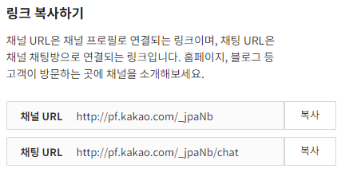

# 블록체인 코드

## 1. 스마트 컨트랙트 배포
- 기본적으로 스마트 컨트랙트는 openzeppelin 프레임워크를 사용
- ERC721 토큰에 tokenURI(*ipfs해쉬 값 저장)를 저장하여 데이터를 블록체인에 기록

    ```solidity
    // 대표 기능인 NFT 민팅 함수
    function mintNFT(address to, string memory tokenURI)
            public onlyOwner
            returns (uint256)
        {
            _tokenIds.increment();

            uint256 newItemId = _tokenIds.current();
            _mint(to, newItemId);
            _setTokenURI(newItemId, tokenURI);

            return newItemId;
        }
    ```

<br/>

## 2. VUE, 스마트 컨트랙트 연동(with metamask)
- 메타마스크와 프론트를 연동하여 보유 지갑주소 값을 호출

    ```javascript
    const accounts = await ethereum.request({ method: 'eth_requestAccounts' });
    ```

- web3로 프론트와 스마트 컨트랙트 간 데이터 전달

    ```javascript
    // web3 임포트
    var Web3 = require('web3');

    var web3 = new Web3(new Web3.providers.HttpProvider('https://rinkeby.infura.io/v3/1b71a03449674cfe98b98c4915a7cbc7'));
    // 컨트랙트 abi와 주소를 통해 배포한 컨트랙트를 지정
    let contract = new web3.eth.Contract( contractInfo.abi, contractInfo.address)
    ```

<br/>

## 3. NFT 조회
- openzeppelin ERC721 함수를 사용, 잔고(NFT 수량) 확인

    ```javascript
    const balance = await contract.methods.balanceOf(sendAccount).call();
    ```

- tokenOfOwnerByIndex 함수로 토큰 소유주의 tokenId 확인

    ```javascript
    await contract.methods.tokenOfOwnerByIndex(sendAccount, i).call())
    ```

- tokenURI(tokenID) 함수를 통해 토큰에 저장된 URI의 값을 호출하여 데이터 조회 

    ```web3
    contract.methods.tokenURI(element).call()
    ```

<br/>

## 4. NFT 이전
- NFT 이전시에는 프라이빗 값이 요구됨, privateKeyToAccount로 sender 주소를 지정

    ```javascript
    var sender = web3.eth.accounts.privateKeyToAccount('0x'+receiveKey)
    ```

- web3.eth.accounts.wallet.add(sender)를 통해 signTransaction does not exist 에러 방지

- safeTransferFrom 함수로 소유권이 있는 토큰을 타인에게 이전 가능 ( approved 등의 함수를 통해 소유권 획득 가능)

    ```javascript
    await contract.methods.safeTransferFrom(sendAccount,receiveAccount,parseInt(tokenId)).send({from: sendAccount,gas:600000, })
    ```

<br/>

## 5. NFT 발급

    ```javascript
    const abc = await contract.methods.mintNFT("받는사람 주소","저장할 데이터").send({from: "sender주소",gas:600000, })
    ```

- 기본적으로 이전에 기술한 NFT민팅 함수를 해당 코드를 통해 호출하여 NFT 발급을 완료함. NFT에 정보를 기록하는 방법으로 ipfs해쉬 값을 저장하는 방법을 사용.

- ipfs-http-client 라이브러리를 통해 해쉬값을 읽을 수 있음.

- ipfs private network를 구축하여 분산된 저장을 통해 더욱 보안적인 측면이 강화됨.


<br/><br/>

# IPFS

### 1. 로컬에서 테스트 할 경우 docker-compose.yml 파일의 volumes 위치 수정 후 CMD창에서 ***docker-compose up*** 명령어 입력하면 IPFS가 자동 빌드 된다.

<br/>
  
### 2. 서버에 올라갈 땐 ***Jenkins branch***로 push를 할 경우, ***docker-compose.yml*** 파일을 자동 build하도록 ***shell script***를 작성해 두었다. 

<br/>

### 3. 이때, ***frontend***와 ***backend***도 ***docker-compose.yml*** 파일에 포함되어 같이 build된다.

<br/>
 
### 4. 각 IPFS config 파일 아래와 같이 수정
- cors 에러를 해결하기 위함
    ```shell
    {
        "API": {
        "HTTPHeaders": {
            "API.HTTPHeaders.Access-Control-Allow-Methods": [
            "PUT",
            "POST",
            "GET"
            ],
            "Access-Control-Allow-Origin": [
                "*"
            ]
        }

        ....

        "Gateway": {
        "APICommands": [],
        "HTTPHeaders": {
        "Access-Control-Allow-Headers": [
            "*"
        ],
        "Access-Control-Allow-Methods": [
            "GET",
            "POST",
            "PUT"
        ],
        "Access-Control-Allow-Origin": [
            "*"
        ]
    },
    ```
<br/>

### 5. 각 IPFS 0 ~ 2 폴더 안에 동일한 ***swarm.key***를 가지도록 설정

    ```bash
    // 1. key 생성 오픈소스 다운
    git clone https://github.com/Kubuxu/go-ipfs-swarm-key-gen.git

    // 2. 폴더로 들어감
    cd go-ipfs-swarm-key-gen

    // 3. main.go 파일이 빌드 됨
    go build ipfs-swarm-key-gen/main.go

    // 4. 빌드된 파일 실행 아래 위치로 swarm.key를 만듬
    ./main > /home/ubuntu/docker-volume/compose/swarm.key

    // 5. 키 실행
    cat /home/ubuntu/docker-volume/compose/swarm.key

    // 실행 결과
    /key/swarm/psk/1.0.0/
    /base16/
    1b8eaa4d914fe80ad90c1be32ae964f652ce8cd5bafe5d696d71df8483b173eb

    // 6. ipfs root 폴더로 각각 복사
    ```

<br/>

### 6. ipfs가 AWS EC2에서 정상적으로 작동하고 있다면 ***ipfs-http-client*** API를 통해서 통신

<br/><br/>

# 카카오 챗봇
### 1. 채널 만들기 하면 채널 url 자동으로 생성

<br/>

### 2. 하단의 url 주소로 들어가면 챗봇 이용 가능


<br/>

### 3. 카카오 채널 기능 구현을 위한 KaKao SDK 설치

```javascript
<!-- 카카오 챗봇 -->
<script src="https://developers.kakao.com/sdk/js/kakao.js"></script>

    <meta charset="utf-8"/>
    <title>Kakao JavaScript SDK</title>
    <script src="https://cdn.jsdelivr.net/npm/ipfs-http-client/dist/index.min.js"></script>
    <script>
    // SDK를 초기화 합니다. 사용할 앱의 JavaScript 키를 설정해 주세요.
    Kakao.init('JAVASCRIPT_KEY');

    // SDK 초기화 여부를 판단합니다.
    // console.log(Kakao.isInitialized());
</script>
```

<br/>

### 4. 사용자가 서비스의 카카오톡 채널과 1:1 채팅을 시작하는 기능을 제공하는 연결 페이지 호출

```javascript
<!-- 챗봇 -->
<script>
    window.kakaoAsyncInit = function() {
    Kakao.Channel.createChatButton({
        container: '#kakao-talk-channel-chat-button',
    });
    };

    (function(d, s, id) {
    var js, fjs = d.getElementsByTagName(s)[0];
    if (d.getElementById(id)) return;
    js = d.createElement(s); js.id = id;
    js.src = 'https://developers.kakao.com/sdk/js/kakao.channel.min.js';
    fjs.parentNode.insertBefore(js, fjs);
    })(document, 'script', 'kakao-js-sdk');
</script>
```