# COUNTING STARS
## 한 줄 소개

### **`위 변조가 불가능한 NFT 보증서를 발급하여 판매된 명품이 정품이라는 것을 보장할 수 있도록 하는 B2B 디지털 명품 인증 솔루션`**

 

## 기획 배경
1. 매년 커져가는 명품시장의 규모
   
2. 명품 시장의 규모가 커질 수록 가품 문제 증대

3. 온라인 명품 판매점의 신뢰성 부재

4. 중고 명품 거래의 비활성화

 

## 기획 의도
1. Counting Stars의 기획 배경은 파트너사들과의 협력이 명품시장의 발전으로 이어져 나갈 수 있다는 비전에서 탄생했습니다. 

2. Counting Stars는 명품 브랜드들의 탄생 이례로 끊임없이 싸워왔던 진품 보증 문제를 해결함으로써 새로운 기술 허브로 발돋움 하기 위한 서비스입니다.
   
3. Counting Stars는 명품을 구매하는 고객의 구매 경험을 개선하기 위해 신뢰할 수 있고 지속 가능한 새로운 가치를 만들어 낼 수 있는 서비스를 제공합니다.
   
4. Counting Stars는 블록체인의 잠재력을 통해 그동안 힘들다고만 생각해왔던 가품구매의 위험에서 소비자들을 보호하며 새로운 시대를 맞이할 것입니다.

 

## 서비스 특징
1. 모든 명품 파트너사 혹은 명품 구매자들은 규모에 상관없이 누구나 손쉽게 블록체인을 통한 명품 보증 서비스를 사용할 수 있습니다. 

2. Counting Stars는 위 변조가 불가능한 대체 불가능한 토큰(NFT)과 IPFS 기술을 활용하여 모든 고객에게 투명성을 제공하고 신뢰성을 확보합니다.

3. Counting Stars는 명품 구매자들을 위한 디지털 보증 서비스부터 중고시장 판매 시 진품 증명 및 소유권 이전 서비스를 제공합니다.
     
4. 발급된 디지털 인증서를 자신의 지갑를 통해 확인할 수 있으며 모든 기록을 한 눈에 확인할 수 있습니다

  

# 프로젝트 팀원
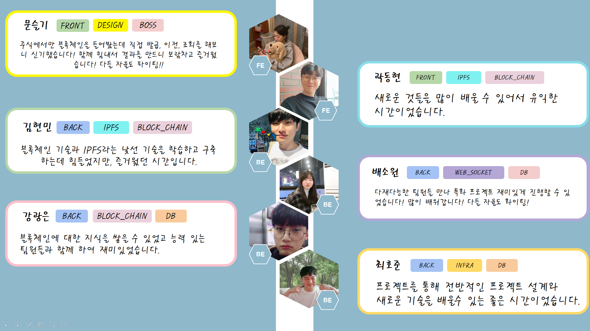

## 프로젝트 진행기간
- 2022.02.28 ~ 2022.04.08 (6주)

 

## 주요 협업 툴
- Jira
- MatterMost
- GitLap
- [Notion](https://changeable-terrier-de5.notion.site/2d6fe15f81c34256ac29676609e2db78)

  

# 기술 스택
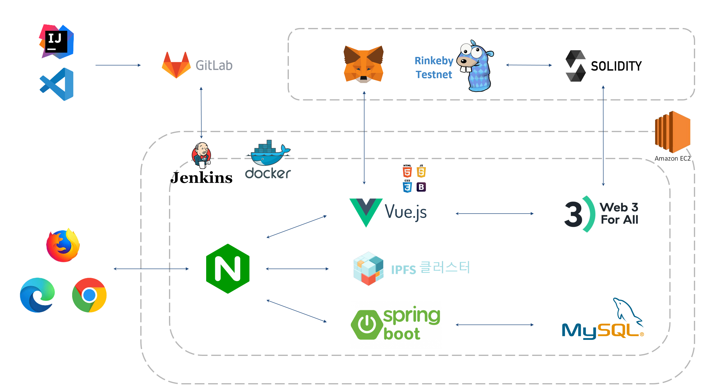
1. AWS EC2에 docker-compose.yml 파일로 Frontend, Backend, IPFS가 빌드된다.
2. Jenkins가 
3. Vue.js와 Metameta가 연동하여
4. Nginx.conf 파일을 통해 Spring 8443 port, Vue 443 port, IPFS

  

# 메인페이지

## 메인 UI
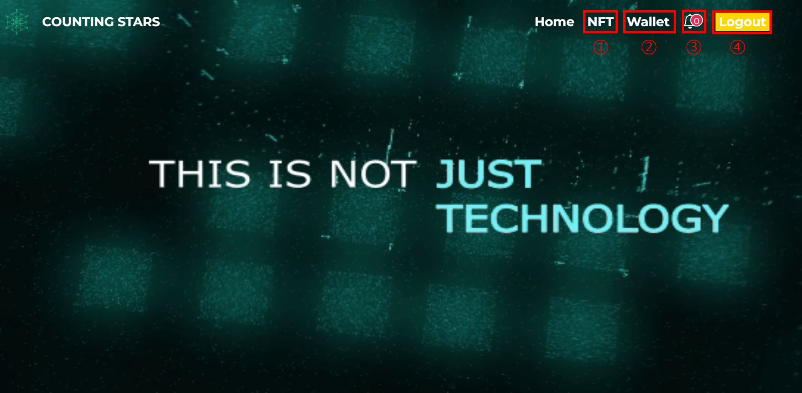
1. 네브바의 NFT 버튼을 누르면 NFT 서비스 화면으로 넘어갈 수 있다. 만약 로그인이 되어 있지 않다면 로그인이 필요하다는 메세지가 화면 아래 출력된다.

2. 네브바의 wallet을 누르면 메타마스크의 계정과 연동할 수 있다.
   
3. NFT가 이전되어 계정으로 들어오면 종모양에 알림이 표시가 된다.
   
4. 로그인 / 로그아웃 버튼을 눌러 로그인 및 회원 가입, 그리고 로그아 웃이 가능하다.

 

## 메타마스크 연동
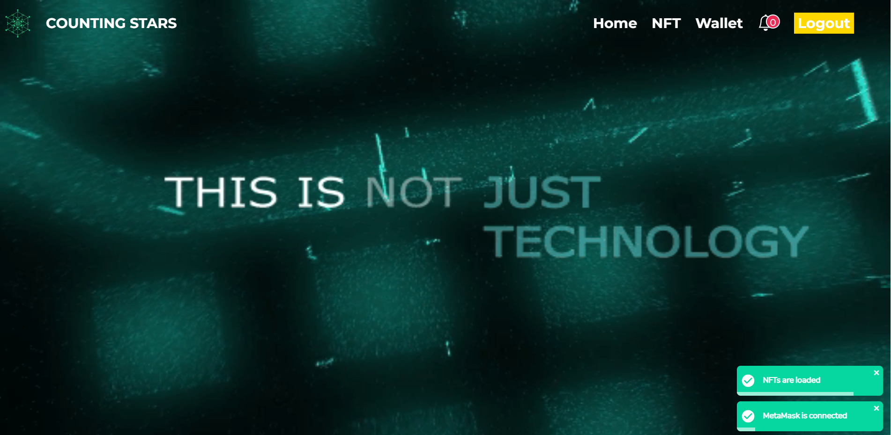
1. 네브바의 wallet 버튼을 누르면 기존 계정과 연동이 된다.
   
2. 오른쪽 하단에 연동 되었다는 알람창과 NFT 목록을 불러오는 알람창이 뜬다.

 

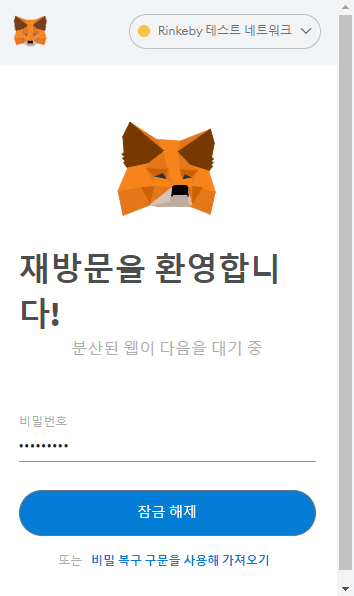
1. 메타마스크가 설치 되어 있는지 확인 할 수 있다.

2. 메타마스크 계정이 연동이 안되어 있다면 연동을 해야 사이트 이용이 가능하다.

 

## 회원가입
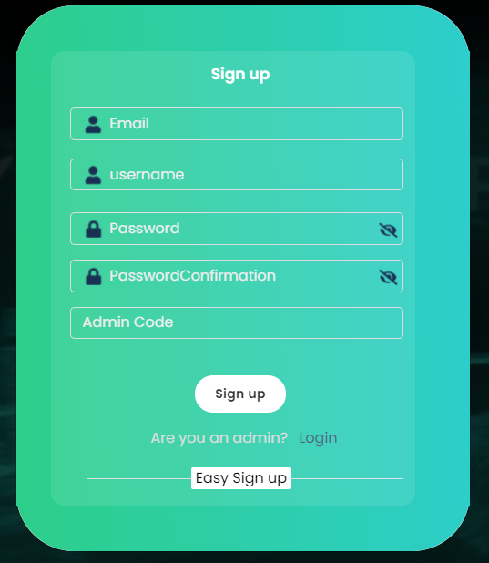
1. 회원가입 폼에 맞게 내용을 입력해준다.
   
2. admin code를 입력하지 않으면 자동으로 일반 유저로 가입이된다.
   
3. 브랜드사, 매장, admin일 경우 입력 후 별도의 키를 입력하면 역할을 따로 부여받는다.

 

## 로그인
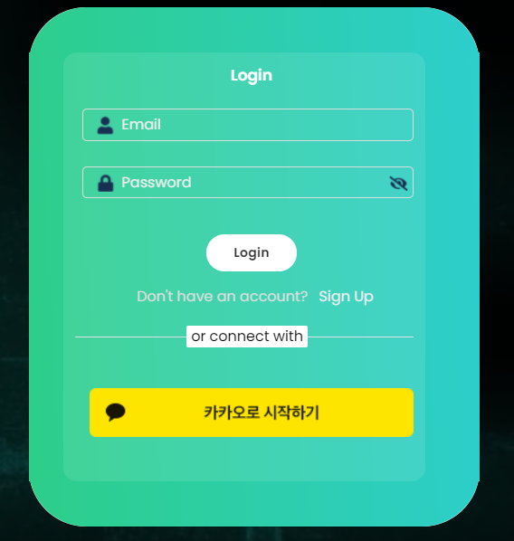
1. 가입한 아이디를 로그인 폼에 맞게 입력하고 로그인을 할 수 있다.
   
2. 카카오톡 간편로그인도 가능하도록 구현 돼 있다.

  

## 사이트 소개
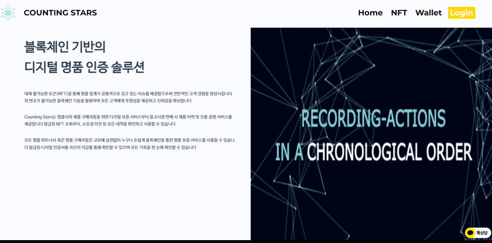
1. 메인페이지에서는 사이트 소개와, 협력사, 블록체인에 대한 설명을 볼 수 있다.

  

# NFT

## MY NFT
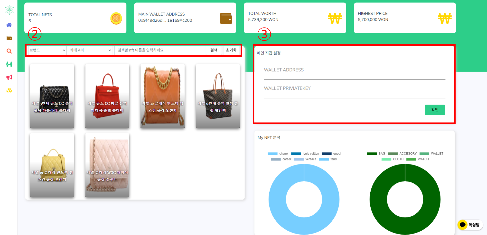
1. 보유한 NFT 목록과 소유한 NFT 정보를 확인할 수 있다.
   
2. 셀렉트 박스를 통해 원하는 NFT를 검색하여 찾을 수 있다.
   
3. 지갑 주소와 Private Key를 입력하여 메인지갑을 설정할 수 있다.
   
4. 메인지갑을 설정하면 보유한 브랜드, 상품에 대한 차트를 볼 수 있다.
   
5. 상단에서 자신의 보유한 NFT 개수, 지갑 주소, 보유 가치, 최고가의 NFT가 얼마인지 확인 가능하다.

 

## NFT 조회
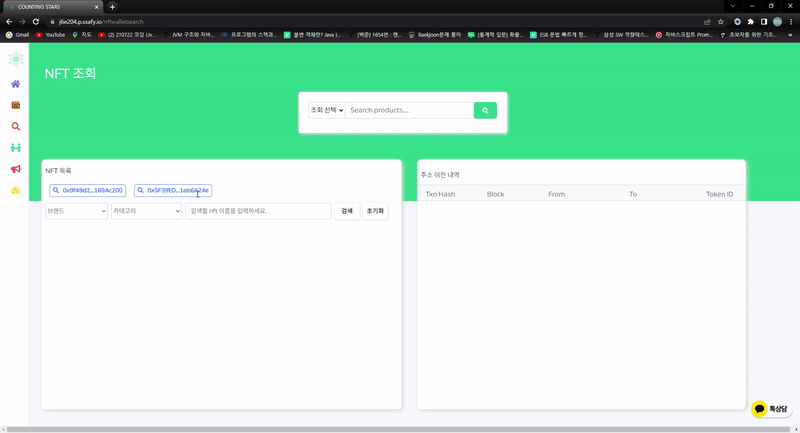
1. 지갑주소와 아이디를 통해 다른 사람의 NFT를 조회할 수 있다.
   
2. 그 지갑의 NFT 이전 내용을 확인할 수 있다.
   
3. 이전에 검색 했던 주소를 다시 쉽게 검색할 수 있도록 최근 검색 목록이 출력된다.
   
4. 트랜잭션 해쉬값을 클릭하면 상세 정보창이 나타난다.
   
5. 셀렉트 박스를 통해 원하는 NFT를 검색하여 찾을 수 있다.

 

## NFT 이전
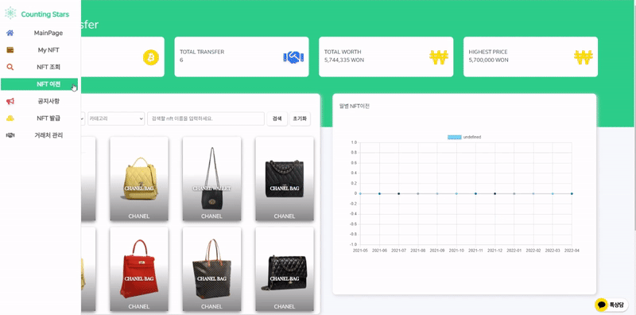

1. 자신이 소유한 NFT 목록과 정보를 확인할 수 있다.
   
2. 월별 이전 내용을 확인할 수 있다.
   
3. NFT 이전 랭킹을 볼 수 있다.
   
4. 소유한  NFT를 선택하여 다른 사람에게 이전을 할 수 있다.
   
5. 셀렉트 박스를 통해 원하는 NFT를 검색하여 찾을 수 있다.

 

## NFT 이전 알람

1. NFT를 이전 받게 되면 메인화면 종모양에 알림이 표시되고, 받은 NFT 목록창을 확인할 수 있다.

 

## NFT 일괄 발급
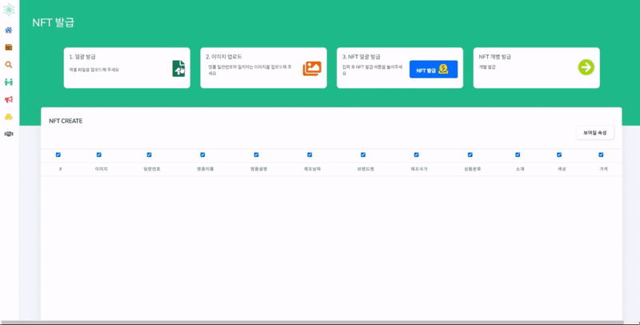
1. 엑셀파일의 명품 정보를 업로드하여 NFT를 한번에 여러개 발급할 수 있다.
   
2. 명품 일련번호와 일치하는 이미지를 업로드 할 수 있다.
   
3. NFT 발급을 누르게 되면 이미지나 정보가 누락된 명품들을 제외하고 모두 발급한다.

4. 혹시나 정보가 잘못 된 것이 있을 경우 페이지에서 바로 수정해서 발급이 가능하다.

5. 수정의 편의를 고려하여 체크 박스를 통해 정보 표시 / 비표시 할 수 있다.

 

## NFT 개별 발급
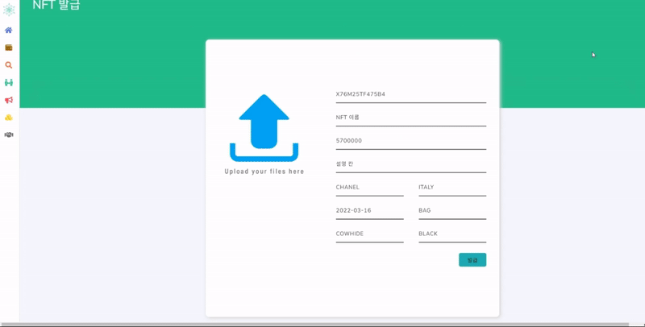
1. 개별 발급을 하고 싶다면 NFT 개별 발급 버튼을 통해 개별 발급 페이지로 이동할 수 있다.
   
2. NFT 정보를 입력 폼에 맞게 입력하여 NFT를 개별 발급 할 수 있다

  

# 관리자 페이지
## 챗봇

1. 고객사나 일반 유저들은 챗봇을 이용 할 수 있다.
   
2. 질문을 남기면 admin 계정으로 챗봇 메세지가 간다.
  
3. 사이트 관리자는 유저에게 카카오 메세지로 답변을 줄 수 있다.

 

## 공지사항
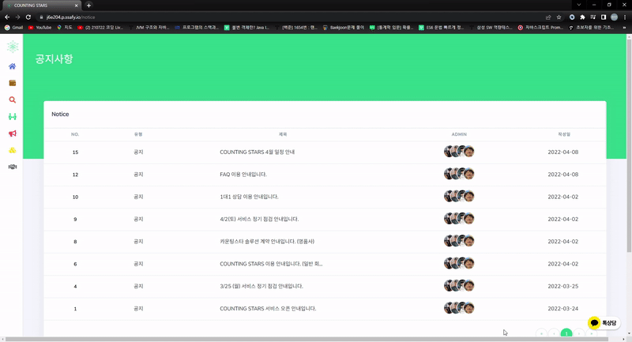
1. 일반 유저들은 공지사항을 확인할 수 있다.
   
2. admin 계정은 공지사항을 등록, 수정, 삭제가 가능하다.

  

## 거래처관리 페이지
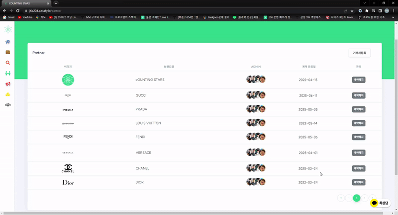
1. admin 계정은 거래처를 등록하고 삭제할 수 있다.
   
2. 등록된 거래처 목록은 NFT를 조회할 때 브랜드에 자동으로 담긴다.